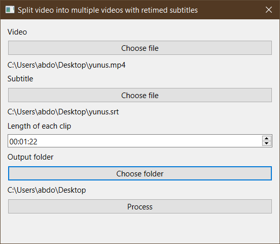

This is a simple program that splits subtitled videos into multiple files and generate retimed .srt subs for each video.

## Usage

Just download the executable from the Releases page (Only Windows binaries are available currently).

You can alternatively build the program yourself using the included [Makefile](./Makefile) after downloading
the Python dependencies.

## Credit

- The icon is adapted from an icon from https://icons.getbootstrap.com/
- [taskman.py](./src/taskman.py) is mostly copied from [ankitects/anki](https://github.com/ankitects/anki/blob/ae18ba2a05dad1a4860f8a638318e4a0a5c6f52a/qt/aqt/taskman.py) with some modifications.
